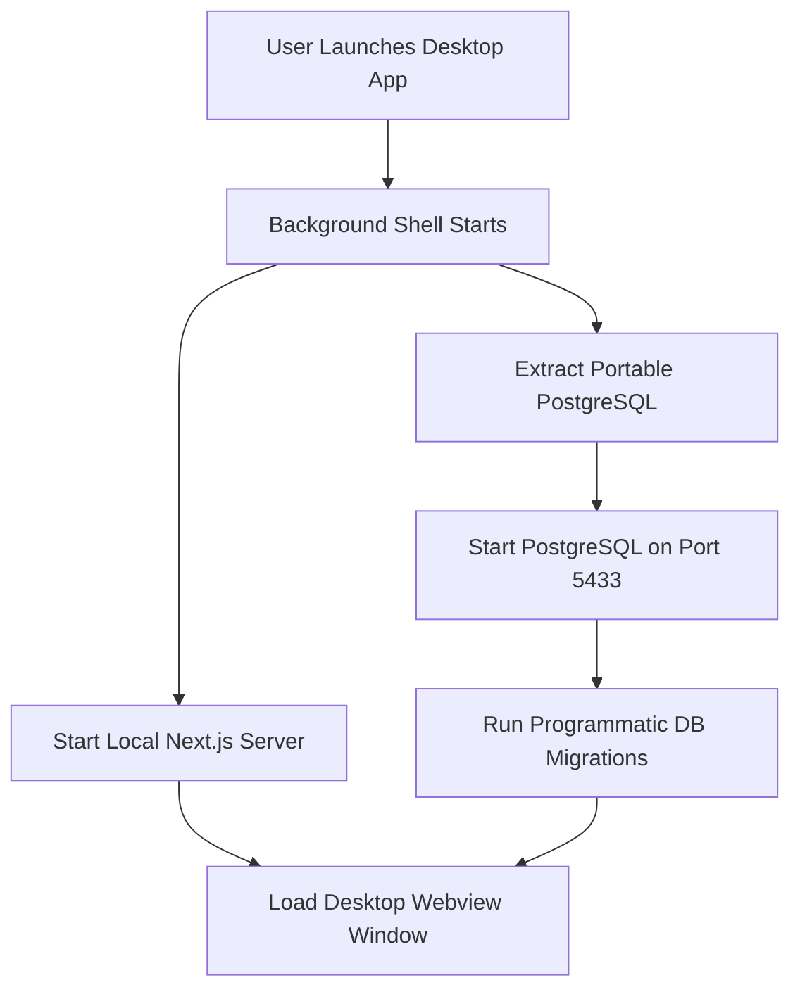

# Setup Guide: Packaging Saloon PWA as a Desktop App

This guide explains how to package the **Next.js 16.3.1 (App Router)** and **PostgreSQL (Drizzle ORM)** application into a single, installable desktop executable (`.app` for macOS or `.exe` for Windows). 

This allows the entire system to run **100% offline** on the shop floor without requiring the owner to manually install Node.js, PostgreSQL, or open the terminal.

---

## 1. ARCHITECTURE OVERVIEW

When the user launches the desktop app, the background shell manages the entire infrastructure lifecycles:



---

## 2. TECHNOLOGY SELECTION (TAURI VS ELECTRON)

We recommend using **Tauri** due to its lightweight nature (applications are ~15MB compared to Electron's ~120MB), but **Electron** is also fully compatible:

*   **Tauri**: Uses the OS's native webview (WebKit on macOS, WebView2 on Windows) and runs background operations using Rust. Highly secure and lightweight.
*   **Electron**: Bundles Chromium and Node.js. Slightly easier to set up for JavaScript developers but produces larger files.

---

## 3. HOW THE DATABASE AUTOMATION WORKS

### A. Portable PostgreSQL Binaries
Instead of a system-wide installation, we bundle a portable zip of PostgreSQL inside the app's resource folder.
*   **macOS**: [Postgres.app Binaries](https://postgresapp.com/) or EnterpriseDB portable binaries.
*   **Windows**: [EnterpriseDB Portable ZIP](https://www.enterprisedb.com/download-postgresql-binaries).

When the app launches:
1.  The app checks if the DB directory exists in the user's application data folder:
    *   **macOS**: `~/Library/Application Support/SterlingGroom/db`
    *   **Windows**: `%APPDATA%\SterlingGroom\db`
2.  If it doesn't exist, it extracts the portable binaries and initializes the database directory:
    ```bash
    initdb -D ./db-data -U postgres --auth=trust
    ```
3.  The database server is started on a custom port (e.g. `5433` to prevent conflicts with other Postgres installations):
    ```bash
    pg_ctl -D ./db-data -l logfile -o "-p 5433" start
    ```

### B. Connection String Setup
The application connects to the local database using the connection string configured by the startup script:
```env
DATABASE_URL="postgresql://postgres@localhost:5433/sterling_db"
```

### C. Programmatic Migrations
At startup, after the database is online, the Node.js process runs migrations using Drizzle ORM to create or update all tables:
```typescript
import { db } from './lib/db';
import { migrate } from 'drizzle-orm/neon-http/migrator'; // or pg driver equivalent

async function runMigrations() {
  console.log('Running database migrations...');
  await migrate(db, { migrationsFolder: './drizzle' });
  console.log('Database schemas are up to date!');
}
```

---

## 4. STEP-BY-STEP INTEGRATION PROCESS (TAURI)

### Step 1: Install Tauri CLI
Add Tauri dependencies to your Next.js project:
```bash
pnpm add -D @tauri-apps/cli
pnpm add @tauri-apps/api
```

### Step 2: Initialize Tauri Config
Run the initialization wizard:
```bash
pnpm tauri init
```
Provide the following configurations when prompted:
*   **Window title**: `Sterling Groom OS`
*   **Frontend dev server URL**: `http://localhost:3000`
*   **Frontend build path**: `../out` (if static) or keep custom dev server.

### Step 3: Bundle Portable Database
1. Download the portable zip of PostgreSQL.
2. Put the binaries inside `src-tauri/binaries/` folder.
3. Configure Tauri `tauri.conf.json` to bundle them as external binaries:
```json
"bundle": {
  "resources": [
    "binaries/*"
  ]
}
```

### Step 4: Write Rust Startup Hooks
Modify `src-tauri/src/main.rs` to start and stop the local PostgreSQL database engine:

```rust
use std::process::Command;
use tauri::Manager;

fn main() {
  tauri::Builder::default()
    .setup(|app| {
      // 1. Extract and start local portable PostgreSQL database engine
      let resource_path = app.path_resolver()
        .resolve_resource("binaries/pg_ctl")
        .expect("failed to resolve path");
        
      Command::new(resource_path)
        .args(&["-D", "./db-data", "-o", "-p 5433", "start"])
        .spawn()
        .expect("failed to start database");

      Ok(())
    })
    .run(tauri::generate_context!())
    .expect("error while running tauri application");
}
```

### Step 5: Build Desktop Executable
Compile the project to generate native installation files:
```bash
pnpm tauri build
```
This generates:
*   **macOS**: `Sterling Groom.dmg` or `Sterling Groom.app`
*   **Windows**: `Sterling Groom.msi` or `Sterling Groom.exe`

---

## 5. PACKAGING USING "PKG" (NODE BINARY PACKAGER)

If you prefer to avoid Tauri/Rust, you can compile the project using `pkg`:

1.  Install `pkg`:
    ```bash
    pnpm add -D pkg
    ```
2.  Configure `package.json` to target the executable output:
    ```json
    "bin": "./src/server.js",
    "pkg": {
      "assets": [".next/**/*", "public/**/*", "drizzle/**/*"]
    }
    ```
3.  Run compilation:
    ```bash
    npx pkg . --targets node18-macos-x64,node18-win-x64 --out-path ./dist
    ```

This produces a single, runnable binary containing the Node.js runtime and Next.js backend, ready to execute on the client's device.
